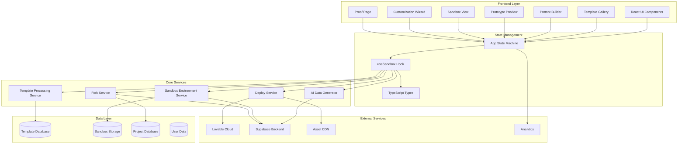
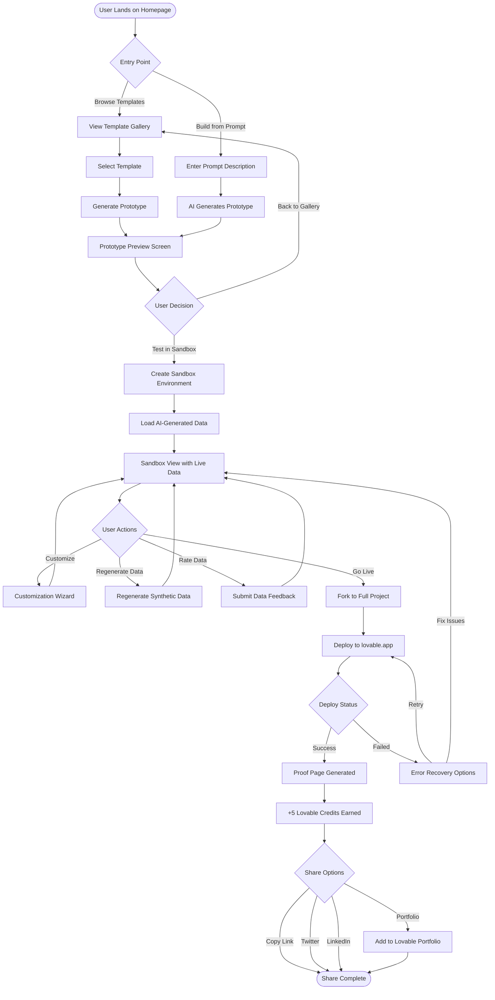
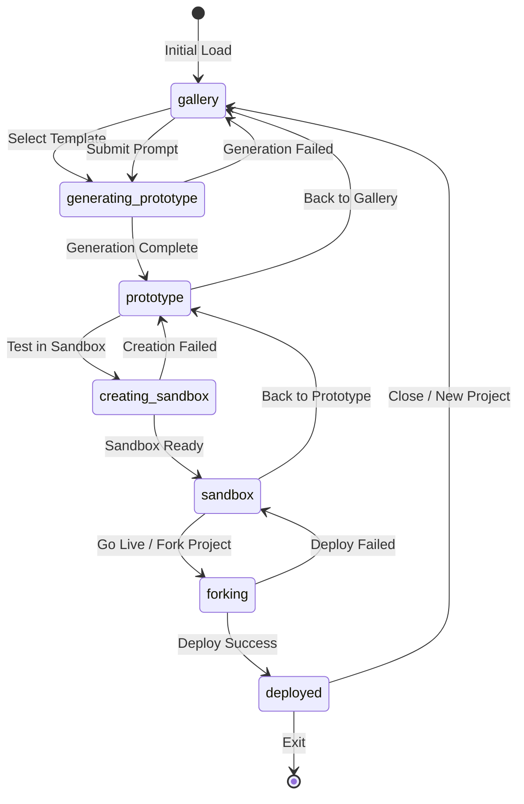

# Smart Sandbox - Complete Product Documentation

## Executive Summary

Smart Sandbox is a feature designed to solve a critical activation problem: users browse templates and tutorials but rarely ship anything live. By providing zero-friction sandbox environments with AI-generated data, we create a smooth path from exploration to deployment.

---

## 1. System Architecture



### Architecture Components

| Component | Responsibility |
|-----------|---------------|
| **Frontend Layer** | React components for UI rendering and user interactions |
| **State Management** | Centralized state machine managing app flow and sandbox lifecycle |
| **Core Services** | Business logic for sandbox creation, data generation, and deployment |
| **Data Layer** | Persistent storage for templates, sandboxes, projects, and user data |
| **External Services** | Cloud infrastructure, authentication, and analytics |

---

## 2. User Journey



### Journey Phases

| Phase | Duration | Key Actions |
|-------|----------|-------------|
| **Discovery** | ~30 seconds | Browse templates or enter prompt |
| **Prototype** | ~3 seconds | View generated prototype preview |
| **Sandbox** | 5-30 minutes | Test with data, customize, iterate |
| **Deployment** | ~30 seconds | Fork and deploy to production |
| **Celebration** | ~1 minute | View proof page, earn credits, share |

---

## 3. Feature Specifications

### 3.1 Template Gallery

**Purpose:** Primary discovery mechanism for pre-built solutions

**Features:**
- Category filtering (E-commerce, SaaS, CRM, etc.)
- Search functionality
- Hover previews with template details
- Popularity indicators
- Author attribution

**UI Components:**
- `TemplateGallery` - Container with filtering
- `TemplateCard` - Individual template display

### 3.2 Build from Prompt

**Purpose:** AI-powered prototype generation from natural language

**Features:**
- Free-form text input
- Smart suggestions and autocomplete
- Real-time generation progress
- Template matching recommendations

**UI Components:**
- `PromptBuilder` - Text input with suggestions
- `HeroSection` - Tab-based entry point toggle

### 3.3 Prototype Preview

**Purpose:** Intermediate view before sandbox commitment

**Features:**
- Visual preview of generated prototype
- Template/prompt summary
- Clear "Test in Sandbox" CTA
- Back to gallery option

**UI Components:**
- `PrototypePreview` - Full-screen preview with actions

### 3.4 Sandbox Environment

**Purpose:** Interactive testing with realistic synthetic data

**Features:**
- AI-generated domain-appropriate data
- Real-time customization
- Data quality feedback (thumbs up/down)
- One-click data regeneration
- 2-hour TTL with countdown timer
- Isolated environment (no PII)

**UI Components:**
- `SandboxView` - Main sandbox interface
- `SandboxTimer` - Countdown display
- `DataQualityFeedback` - Rating interface

### 3.5 Customization Wizard

**Purpose:** Low-friction personalization before deployment

**Steps:**
1. **What are you building?** - Context for data generation
2. **Adjust look & feel** - Brand colors, name, logo
3. **Ready to convert** - Final confirmation

**UI Components:**
- `CustomizationWizard` - Step-by-step wizard

### 3.6 Fork & Deploy

**Purpose:** Convert sandbox to production project

**Features:**
- One-click fork operation
- Schema and data migration options
- Customization preservation
- Automatic deployment to lovable.app

**UI Components:**
- `ForkProjectModal` - Fork confirmation dialog

### 3.7 Proof Page

**Purpose:** Shareable success page celebrating deployment

**Features:**
- Auto-generated project summary
- Live app link
- Social share buttons (Twitter, LinkedIn)
- Portfolio submission option
- Credits earned display (+5)

**UI Components:**
- `ProofPageView` - Celebration and sharing interface

---

## 4. Data Models

### Template
```typescript
interface Template {
  id: string;
  name: string;
  description: string;
  category: string;
  thumbnail: string;
  author: string;
  popularity: number;
  tags: string[];
  previewUrl?: string;
  schema?: TemplateSchema;
}
```

### Sandbox
```typescript
interface Sandbox {
  id: string;
  templateId: string;
  userId: string;
  status: 'creating' | 'ready' | 'error' | 'expired';
  createdAt: Date;
  expiresAt: Date;
  previewUrl: string;
  customizations: SandboxCustomizations;
  dataQuality?: DataQualityFeedback;
}
```

### Project
```typescript
interface Project {
  id: string;
  name: string;
  description: string;
  sandboxId?: string;
  templateId?: string;
  status: 'draft' | 'deploying' | 'live' | 'error';
  deployUrl?: string;
  createdAt: Date;
  updatedAt: Date;
  creditsEarned?: number;
  isInPortfolio?: boolean;
}
```

### Prototype
```typescript
interface Prototype {
  id: string;
  name: string;
  description: string;
  templateId?: string;
  prompt?: string;
  status: 'generating' | 'ready' | 'error';
  previewUrl: string;
  createdAt: Date;
}
```

---

## 5. State Machine



### State Definitions

| State | Description | Available Actions |
|-------|-------------|-------------------|
| `gallery` | Browsing templates or entering prompts | Select template, Submit prompt |
| `generating-prototype` | AI is creating prototype | Wait, Cancel |
| `prototype` | Viewing generated prototype | Test in Sandbox, Back |
| `creating-sandbox` | Provisioning sandbox environment | Wait |
| `sandbox` | Interactive testing with data | Customize, Regenerate, Fork, Back |
| `forking` | Converting to full project | Wait |
| `deployed` | Successfully published | Share, New Project |

---

## 6. API Specifications

### Sandbox Service

```typescript
// Create new sandbox
POST /api/sandbox
Body: { templateId: string, userId: string }
Response: { sandboxId: string, previewUrl: string, expiresAt: Date }

// Update sandbox customizations
PATCH /api/sandbox/:id/customizations
Body: { brandName?: string, primaryColor?: string, description?: string }
Response: { success: boolean }

// Regenerate sandbox data
POST /api/sandbox/:id/regenerate
Body: { category?: string }
Response: { success: boolean, rowsGenerated: number }

// Submit data feedback
POST /api/sandbox/:id/feedback
Body: { rating: 'positive' | 'negative', comment?: string }
Response: { success: boolean }

// Fork sandbox to project
POST /api/sandbox/:id/fork
Body: { projectName: string, includeData: boolean }
Response: { projectId: string, deployUrl: string }
```

### Analytics Events

```typescript
type SandboxEvent = {
  type: 
    | 'sandbox_created'
    | 'sandbox_interaction'
    | 'data_regenerated'
    | 'data_feedback'
    | 'wizard_step'
    | 'fork_initiated'
    | 'fork_completed'
    | 'deploy_started'
    | 'deploy_success'
    | 'deploy_failed'
    | 'proof_page_shared';
  sandboxId?: string;
  projectId?: string;
  templateId: string;
  userId: string;
  metadata?: Record<string, unknown>;
  timestamp: Date;
}
```

---

## 7. Metrics & KPIs

### North Star Metric
**Template View → Public Deploy within 7 days: Target 15%**

### Leading Indicators

| Metric | Target | Measurement |
|--------|--------|-------------|
| Template → Sandbox Rate | 40% | % viewers who open sandbox |
| Sandbox Interaction Rate | 70% | % sandbox users with 3+ actions |
| Sandbox → Fork Rate | 25% | % sandboxes converted to projects |
| Fork → Deploy Rate | 80% | % forked projects successfully deployed |

### Experience Metrics

| Metric | Target | Measurement |
|--------|--------|-------------|
| Time to First Preview | <10s | Sandbox creation latency |
| Time to First Deploy | <30min | Sandbox → live deploy |
| Credits per Deploy | <10 | Average credits consumed |
| Data Quality Score | 4.2/5 | User feedback ratings |

---

## 8. Security & Guardrails

### Data Safety
- ✅ No PII in synthetic data generation
- ✅ Sandboxes isolated per user
- ✅ Temporary secrets discarded on teardown
- ✅ 2-hour TTL with auto-cleanup

### Abuse Prevention
- ✅ Max 5 sandboxes per user per day
- ✅ Rate limiting on data regeneration
- ✅ No production database access from sandbox

### Cost Control
- ✅ Sandbox operations don't consume credits
- ✅ Credit usage visible before heavy operations
- ✅ No charges for system-caused deploy failures

---

## 9. Rollout Plan

### Phase 1: Alpha (Week 1-2)
- Internal team testing
- 100 beta users
- Manual monitoring
- Collect feedback on data quality

### Phase 2: Beta (Week 3-4)
- 1,000 users via waitlist
- A/B test vs current flow
- Iterate on UX friction points
- Monitor conversion metrics

### Phase 3: General Availability (Week 5+)
- Full rollout to all users
- Marketing campaign
- Template creator incentives
- Portfolio showcase launch

---

## 10. Future Enhancements

### Short-term (Q1)
- [ ] AI data refinement based on feedback
- [ ] Collaborative sandbox sharing
- [ ] Template creator revenue share

### Medium-term (Q2)
- [ ] Mobile-optimized sandbox experience
- [ ] Custom domain support for proof pages
- [ ] Integration marketplace in sandbox

### Long-term (Q3+)
- [ ] Multi-sandbox comparison view
- [ ] Sandbox versioning and rollback
- [ ] Enterprise team sandboxes

---

## Appendix: UI Copy Guidelines

### Differentiating States

| Context | Copy Style |
|---------|------------|
| **Sandbox** | "This is your playground - experiment freely!" |
| **Forking** | "Ready to make it real? Let's go live!" |
| **Deployed** | "You shipped it! 🎉 Share your creation" |

### Error Messages

| Scenario | Message |
|----------|---------|
| Sandbox creation failed | "Couldn't spin up your sandbox. Try again?" |
| Data generation failed | "Having trouble generating data. Regenerate or try a different category." |
| Deploy failed | "Deploy hit a snag. Here's what went wrong: [error]. Try fixing automatically?" |

### Success Messages

| Scenario | Message |
|----------|---------|
| Sandbox ready | "Your sandbox is ready! Explore with realistic test data." |
| Fork complete | "Your project is live! +5 credits earned." |
| Portfolio added | "Added to Lovable Portfolio! Others can now discover your build." |

---

*Document Version: 1.0*
*Last Updated: November 2024*
*Owner: Smart Sandbox Product Team*
